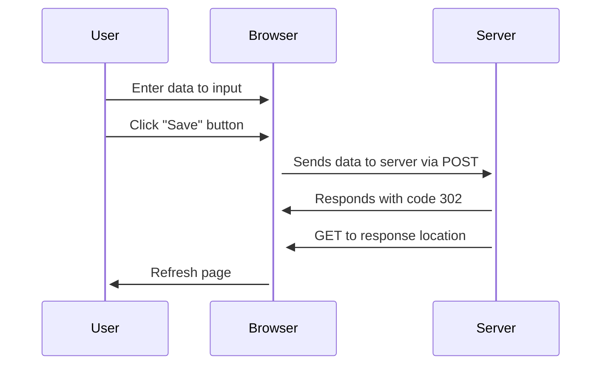

<pre>

```mermaid
sequenceDiagram
    User->>+Browser: Enter data to input
    User->>+Browser: Click "Save" button
    Browser->>+Server: Sends data to server via POST
    Server->>+Browser: Responds with code 302
    Server->>+Browser: GET to response location
    Browser->>+User: Refresh page
```
</pre>

```mermaid
sequenceDiagram
    User->>+Browser: Enter data to input
    User->>+Browser: Click "Save" button
    Browser->>+Server: Sends data to server via POST
    Server->>+Browser: Responds with code 302
    Server->>+Browser: GET to response location
    Browser->>+User: Refresh page 
```